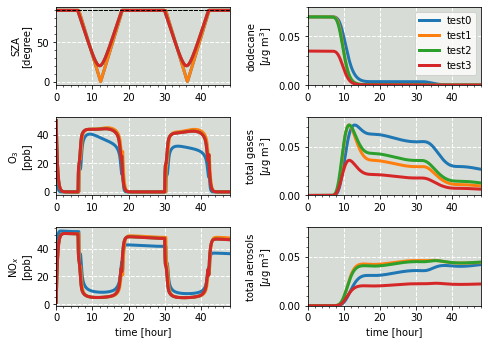

# Load multiple csv files and join


```python
# ====================================================================
# This simple jupyter notebook demonstrates:
#   - How to load csv file(s)
#   - How to pack data into dataframe, and how to manipulate dataframe
# There are many ways to read csv files and this is just one of them..
# By: Siyuan Wang (siyuan@ucar.edu) 13 August 2020
# ====================================================================
```

### Import packages


```python
import pandas as pd
import numpy as np
import matplotlib.pyplot as plt
```

### Define input location


```python
# =================================================================
# this folder contains a number of csv files
# we can pack each into a dataframe and deal with them individually
# alternatively, we can pack them into one list of dataframes
# this makes things easier
# =================================================================
postproc_dir = '/glade/scratch/siyuan/POSTPROCESSING/ML2019_dodecane'
```

### Load


```python
# -----------------------
# "declare" an empty list
# -----------------------
TestCases = []
# ----------------------------------------------------------------
# load csv files as dataframes, then append dataframe to this list
# each component of this list is a whole dataframe
# ----------------------------------------------------------------
TestCases.append( pd.read_csv(postproc_dir+'/TestDiurnal_ML2019_dodecane_t0.csv') ) # T0: Base case...
TestCases.append( pd.read_csv(postproc_dir+'/TestDiurnal_ML2019_dodecane_t1.csv') ) # T1: Same as T0 but NO is halved
TestCases.append( pd.read_csv(postproc_dir+'/TestDiurnal_ML2019_dodecane_t2.csv') ) # T2: Same as T1 but date changed to December (so lower SZA)
TestCases.append( pd.read_csv(postproc_dir+'/TestDiurnal_ML2019_dodecane_t3.csv') ) # T3: Same as T2 but precursor level (dodecane) is halved

print(TestCases[0].keys())

```

    Index([' Time [s]', ' Precursor [ug/m3]', ' Temperature [K]',
           ' OH [molec/cm3]', ' O3 [molec/cm3]', ' NOx [molec/cm3]',
           ' SZA [degree]', ' Gas [ug/m3] Bin01: lg(C*) = -6.5',
           ' Gas [ug/m3] Bin02: lg(C*) = -5.5',
           ' Gas [ug/m3] Bin03: lg(C*) = -4.5',
           ...
           ' N/C Bin05: lg(C*) = -2.5', ' N/C Bin06: lg(C*) = -1.5',
           ' N/C Bin07: lg(C*) = -0.5', ' N/C Bin08: lg(C*) =  0.5',
           ' N/C Bin09: lg(C*) =  1.5', ' N/C Bin10: lg(C*) =  2.5',
           ' N/C Bin11: lg(C*) =  3.5', ' N/C Bin12: lg(C*) =  4.5',
           ' N/C Bin13: lg(C*) =  5.5',
           ' N/C Bin14: lg(C*) =  6.5                                                                                                      '],
          dtype='object', length=133)


### Perform calculations


```python
# ---------------------------------------
# Do a bit manipulation to the dataframes
# ---------------------------------------
for i in range(len(TestCases)):
    # ----------------------------------
    # calculate total gases and aerosols
    # search for "keywords"...
    # ----------------------------------
    gas_bin_list = [element for element in TestCases[i].keys() if 'Gas [ug/m3]' in element]
    aer_bin_list = [element for element in TestCases[i].keys() if 'Aerosol [ug_m3]' in element]
    TestCases[i]['tot_aer'] = TestCases[i][aer_bin_list].sum(axis=1) # calculate total gas concentrations
    TestCases[i]['tot_gas'] = TestCases[i][gas_bin_list].sum(axis=1) # calculate total aerosol concentrations
    # ------------------
    # filter out SZA>=90
    # ------------------
    TestCases[i][' SZA [degree]'] = np.where( TestCases[i][' SZA [degree]']>=90.0, 90.0, TestCases[i][' SZA [degree]'] )

```

### Quick plots to check the input


```python
fig, axs = plt.subplots(nrows=3, ncols=2, figsize=(7,5))

for i in range(len(TestCases)):
    color='C' + str(i)
    axs[0,0].plot(TestCases[i][' Time [s]']/3600.0, TestCases[i][' SZA [degree]'], c=color, linewidth=3)
    axs[0,0].plot([0,100], [90, 90], 'k--', linewidth=1)
    axs[1,0].plot(TestCases[i][' Time [s]']/3600.0, 
                  TestCases[i][' O3 [molec/cm3]'] * (8.314*TestCases[i][' Temperature [K]']/101325.0/6.0232e+8), # convert unit from molec/cm3 to ppb
                  c=color, linewidth=3)
    axs[2,0].plot(TestCases[i][' Time [s]']/3600.0, 
                  TestCases[i][' NOx [molec/cm3]'] * (8.314*TestCases[i][' Temperature [K]']/101325.0/6.0232e+8), # convert unit from molec/cm3 to ppb
                  c=color, linewidth=3)
    axs[0,1].plot(TestCases[i][' Time [s]']/3600.0, TestCases[i][' Precursor [ug/m3]'], c=color, linewidth=3)
    axs[1,1].plot(TestCases[i][' Time [s]']/3600.0, TestCases[i]['tot_gas'], c=color, linewidth=3)
    axs[2,1].plot(TestCases[i][' Time [s]']/3600.0, TestCases[i]['tot_aer'], c=color, linewidth=3)

axs[0,0].set(ylabel='SZA\n[degree]')
axs[1,0].set(ylabel='O$_3$\n[ppb]')
axs[2,0].set(ylabel='NO$_x$\n[ppb]', xlabel='time [hour]')
axs[0,1].set(ylabel='dodecane\n' + r'[$\mu$g m$^3$]')
axs[1,1].set(ylabel='total gases\n' + r'[$\mu$g m$^3$]')
axs[2,1].set(ylabel='total aerosols\n' + r'[$\mu$g m$^3$]', xlabel='time [hour]')

axs[0,1].legend(['test0','test1','test2','test3'], loc='upper right') #, bbox_to_anchor=(1, 1.08))

fig.tight_layout(pad=1.5)

axs[0,1].set_ylim([0, 0.08])
axs[1,1].set_ylim([0, 0.08])
axs[2,1].set_ylim([0, 0.08])

for ax in axs.flat:
    ax.set_xlim([0, 48])
    ax.set_facecolor('xkcd:light grey')
    ax.grid(color='white', linestyle='--', linewidth=1)
    ax.minorticks_on()
```





```python

```
